# PIA SP 2025

## Obsah

- [Úpravy 10/01/2026](#úpravy-10012026)
- [Obsah](#obsah)
- [Popis projektu](#popis-projektu)
- [Použité technologie](#použité-technologie)
- [Struktura projektu](#struktura-projektu)
- [Spuštění](#spuštění)
- [Spuštění testů](#spuštění-testů)
- [Ukázka použití](#ukázka-použití)
- [Další ukázky](#další-ukázky)

## Úpravy 10/01/2026

### Absence dedikovaných datových objektů
- Byla přidána složka `/src/dto`
- Použit pattern, kdy vždy jedna DTO třída má svůj "mapper", podobně jako zde: https://profy.dev/article/react-architecture-domain-entities-and-dtos
- Všechny funkce v `/src/actions` nyní vrací DTO objekt 

### REST API

- Byla přidána REST API poskytující body uvedené v zadání: `API for project management module (project creation, project retrieval, project state changes)`
- SwaggerUI dokumentace dostupná na `localhost:80/api-docs`, zde je možné jednotlivé endpointy vyzkoušet

### Přihlášení přes GitHub

- GitHub přihlášení bylo vždy funkční, jen potřebuje správně nastavit
- Redirect dělá na hlavní stránku, protože nerozlišuje "registraci" a "přihlášení", nicméně uživatel si roli pořád může změnit tlačítkem na stránce `/my-profile`

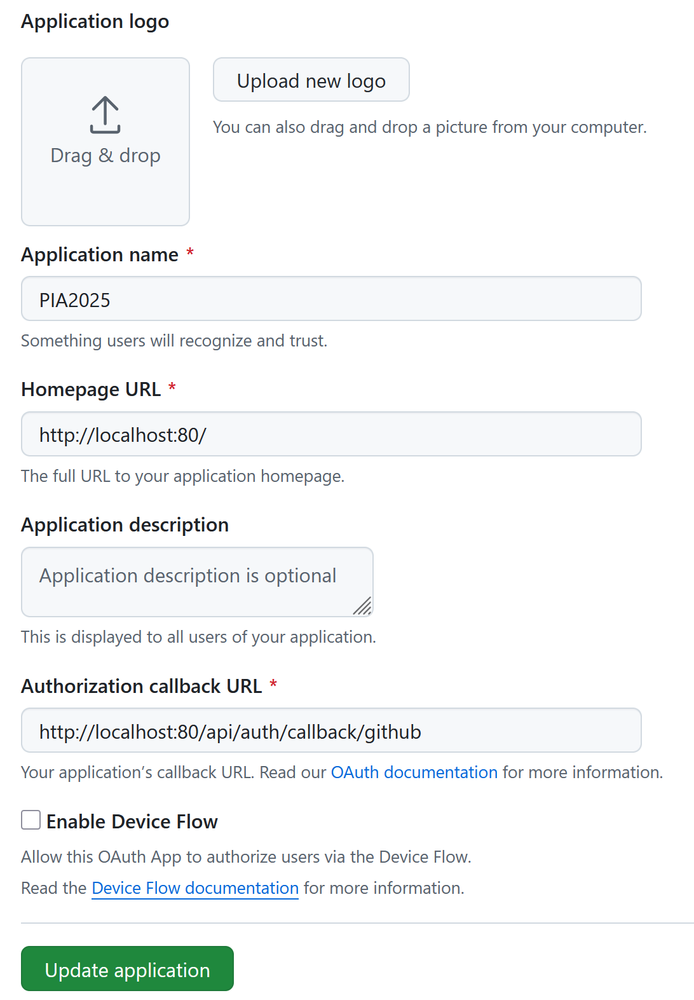

### Nelze sestavit a spustit jedním příkazem, manuální inicializace databáze 

- Drizzle nepodporuje automatické vytvoření tabulek
- Řešením bylo přidání skriptu `drizzle/migrate.sql` vygenerovaného pomocí `drizzle-kit generate`, pak přidání `./drizzle/migrate.sql:/docker-entrypoint-initdb.d/migrate.sql:ro` do docker-compose, to způsobí spuštění skriptu při inicializaci PG databáze
- https://orm.drizzle.team/docs/kit-overview#generate-migrations
- https://www.answeroverflow.com/m/1337125001719058562

### TypeScript konfigurace a chyba kompilace

- Kompilace je úspěšná i **bez** toho, aniž by se do configu přidalo:
```
"allowImportingTsExtensions": true,
"types": ["astro/client"]
```
- V kořenovém adresáři stačí provést příkaz `tsc`:
```
PS C:\Users\PC\Documents\GitHub\pia-sp> tsc
```
- Příkaz nevypisuje žádné chyby - kompilace byla úspěšná
- Že opravdu kompiluje celý projekt si lze ověřit příkazem:
- V kořenovém adresáři stačí provést příkaz `tsc`:
```
PS C:\Users\PC\Documents\GitHub\pia-sp> tsc --listFiles --noEmit
```
- Zde by měl vypsat vše ze složky `/node_modules/` a `/src/`, včetně podsložky `/components/`

### Typescript "as" keyword antipattern

"as" má jiné chování než specifikace typu pomocí ":", například:
```
// test/unit/userRoleManager.test.ts:6
const mockUser = {id: '123'} as User;
```

- je zde "as" použito účelně, jinak by se musel zvlášť nastavit každý atribut objektu, při použití as jsou tak nevyplněné atributy automaticky null


- Nebo:
```
// src/actions/customer.ts:83
const projectId = input.get("projectId") as string | null;
```

- Zde se "as" chová jako "vynucení typu", a nelze ho tak odstranit. Změna na ":" způsobí chybu:

```
// Error: TS2322: Type FormDataEntryValue | null is not assignable to type string | null
const projectId: string | null = input.get("projectId");
```

## Popis projektu

Implementováno na základě:

https://github.com/fidransky/kiv-pia-labs/wiki/Semester-project

Implementována byla webová aplikace pro překlad dokumentů, obsahující tři uživatelské role: Customer, Translator a Administrator. Každá z těchto rolí je zodpovědná za jinou "fázi" projektu.

Aplikace využívá hybridní přístup skládající se z Server Side Rendering a potom React komponent na frontendu. Backend pošle statické části stránky, a hydratuje react komponenty pokud mají nastaven parametr `client:load`, tyto komponenty pak řeší veškeré client-side JavaScript interakce s uživatelem.

Všechna uživatelská data a informace o projektech jsou ukládány v PostgreSQL, pro ukládání souborů byl využit S3-compatible object storage **MinIO**.

Web umožňuje uživateli měnit jazyk kliknutím na tlačítko **Czech** nebo **English** v zápatí stránky.

## Použité technologie

- Framework: 
  - Astro (https://astro.build/)
- ORM: 
  - DrizzleORM (https://orm.drizzle.team/)
- Úložiště
  - PostgreSQL
  - MinIO (https://www.min.io/)
- Login systém
  - Better Auth (https://www.better-auth.com/)
- Frontend:
  - React
  - Tailwind
- Testing framework
  - Vitest (https://vitest.dev/)
- Ostatní závislosti:
  - AWS SDK (S3 klient)
  - astro-icons a iconify-json (ikony v UI)
  - nodemailer (odesílání mailů)
  
## Struktura projektu

V kořenovém adresáři projektu se nacházejí dvě hlavní složky:

- `src`
  - Zdrojové soubory aplikace
- `test`
  - Unit testy a integrační testy

Dalé jsou v kořenovém adresáři následující konfigurační soubory:

- `.env.development`
  - proměnné prostředí pro spuštění aplikace mimo docker
- `.env.docker`
  - proměnné prostředí předané když je aplikace spuštěna v docker kontejneru
  - toto rozdělení je důležité, protože když je v kontejneru, tak již nemůže k ostatním službám přistupovat přes localhost, místo toho musí využít docker network
- `astro.config.mjs`
  - konfigurace astro frameworku
- `auth.ts`
  - konfigurace pro Better Auth
  - nastavení secrets, způsobu přihlašování uživatelů, uživatelských rolí, apod.
  - umožňuje přihlášení i přes GitHub OAuth, tyto secrets jsem ale z env souborů odstranil, aby nebyly ve veřejném Git repozitáři
- `docker-compose.yml`
  - hlavní compose soubor pro tuto aplikaci
- `drizzle.config.ts`
  - nastavení DrizzleORM
- `env.d.ts`
  - nastavení astro.locals, tedy datového objektu který je nastavován v middleware 
- `vitest.config.ts`
  - nastavení testovacího frameworku

Obsah složky src je pak následujcí:

- `actions`
  - Astro Actions, specifikace RPC API
  - V `actions/index.ts` je definován hlavní objekt, do kterého jsou pomocí parametrů předány Actions objekty definované v ostatních souborech 
- `components`
  - UI komponenty, buď React (.tsx) nebo Astro (.astro), výhoda Astro komponent je, že jsou kompletně renderované na serveru (přirozené ale omezenějí použití frontend JS)
- `db`
  - Databáze
  - V souboru orm.ts je definován hlavní ORM objekt, nad kterým je možné provádět SQL dotazy
  - Složka `schemas` obsahuje definice tabulek
  - Ve složce `data_access` se nacházejí funkce pro modifikaci nebo čtení dat z databáze, toto je jediné místo v aplikaci, kde je ORM objekt volán na přímo, díky tomu lze tyto funkce pak snadno mockovat v unit testech
  - DrizzleORM je podobné spíše klasickému SQL než například Java ORM frameworkům. Výsledkem DrizzleORM dotazu je datový objekt, jehož typ je automaticky detekován IDE a kontrolován TypeScript language serverem.
- `i18n`
  - i18n = internationalization
  - Dva soubory umožňující překlad textu v UI komponentách
  - Bez jakékoliv modifikace lze využít úplně stejně jak na frontendu, tak na backendu.
- layouts
  - "kostra" webu která se nemění napříč stránkami, tedy záhlaví, zápatí, apod.
- `lib_backend`
  - knihovna funkcí určená pro použití na backendu
  - Složka `project` obsahuje business logiku ohledně přidělování projektu, voláno z Actions
  - `user_roles` obsahuje definici uživatelských rolí a jejich oprávnění
  - `email.ts` obsahuje funkce pro odesílání emailů
  - `objectStorage.ts` je soubor obsahující funkce pro přístup a modifikaci MinIO úložiště
- `lib_frontend`
  - Funkce pro použití na frontendu
  - Logicky je lze použít také na backendu, pokud je to vhodné
  - Důležitý je zde soubor `AuthClient.ts`, který obsahuje funkce volající Better Auth endpoit
- `middleware`
  - Middleware je spuštěn jako první při každém HTTP requestu, je zde implementována autentizace uživatele, objektu `User` který je v middleware uložen do Astro.locals pak mohou využívat ostatní části aplikace
- `pages`
  - Obsahuje stránky ze kterých je tvořený web
  - Astro používá tzv. file-based routing, tedy obsah této složky určuje strukturu URL
  - Složka `api` uvnitř této složky je výše zmiňovaný Better Auth endpoint
- `styles`
  - Tailwind global stylesheet
  - Tento stylesheet je importován uvnitř layoutu

## Spuštění

- Aplikaci lze spustit pomocí docker compose, navíc je ale potřeba vytvořit databázové tabulky pomocí drizzle-kit
- Protože Drizzle tabulky nevytváří automaticky

Příkazy pro spuštění aplikace tedy jsou:
```
docker compose up
```

Poté co je kontejner s databází spuštěn proveďte v tomto adresáři příkay:
```
npm install
npm drizzle-kit push
```

Po provedení by měla být databáze inicializována a aplikace funkční fuknční.

Webové rozhraní je na `localhost:80`, GUI mail serveru je na `localhost:8080`, MinIO GUI je na `localhost:9001`.

## Spuštění testů

Poté, co bylo provedeno npm install lze testy spustit v tomto adresáři následujícím příkazem:
```
vitest ./test
```

## Ukázka použití

Tato sekce vysvětluje, jak byly implementovány jednotlivé body zadání, včetně ukázky toho, kde se příslušná funkcionalita nachází

1) **Customer creates translation projects in the service, submitting source files (any file type) in English**
- Vytvoříme nového uživatele, jehož role je Customer
- Na hlavní stránce klikneme na "New Project"
- Uživatel nyní může nahrát soubor, poté co ho nahraje je nejdřív vytvořen nový projekt, pak je mu přiřazen soubor a překladatel


2) **Service finds suitable translator for given project based on the target language, assigns the project and notifies the translator via email; if no translator is found, service closes the project and notifies the customer via email**
- Na frontendu je to provedeno v jednom kroku, když uživatel nahraje soubor
- Frontend volá `createProject` uvnitř `/actions/customer.ts`

3) **Translator completes the project, service notifies the customer via email**
- Action `uploadTranslatedFile` uvnitř `/actions/translator.ts`
- Interně volá funkci pro odeslání mailu, poté co je soubor úspěšně nahraný

4) **Customer approves/rejects completed translations and submits feedback to the project**
- Pro uživatele s rolí Customer je to tlačítko na hlavní stránce "Review Projects"
- Volá actions uvnitř `actions/customer.ts`

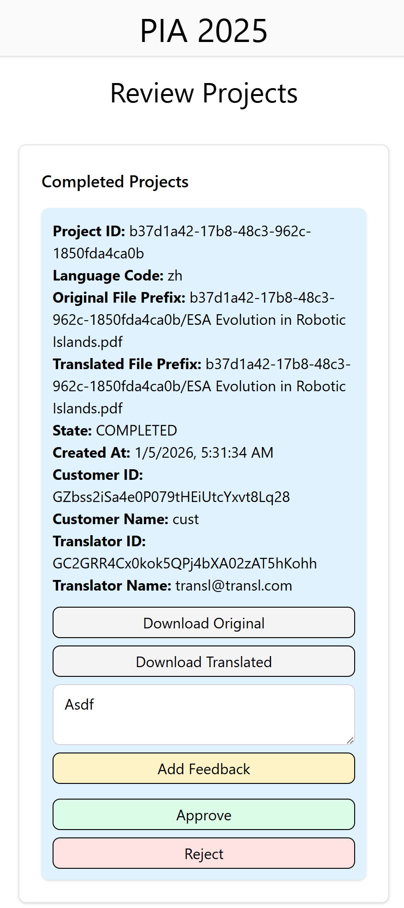

5) **Administrator resolves customer feedback, sending messages to customer/translator and ultimately closing the whole project**
- Uživatel role Administrator vidí na hlavní stránce pod názvem "Admin Project Viewer"
- Náhled ukazuje všechny projekty, co mají přiřazený nějaký feedback, dále je umožňuje filtrovat
- Admin uživatele **nelze vytvořit přes webové UI, uživateli třeba manuálně v databázi nastavit roli Administrator** (tabulka Users)

Pro změnu role použijtě tyto příkazy (se spuštěným Potgres kontejnerem):
```
docker exec -it postgres psql -U myuser -d mydatabase

UPDATE "user" SET role = 'Administrator' WHERE email = '<email_uživatele>@example.com';

SELECT id, email, role FROM "user" WHERE email = '<email_uživatele>@example.com';
```

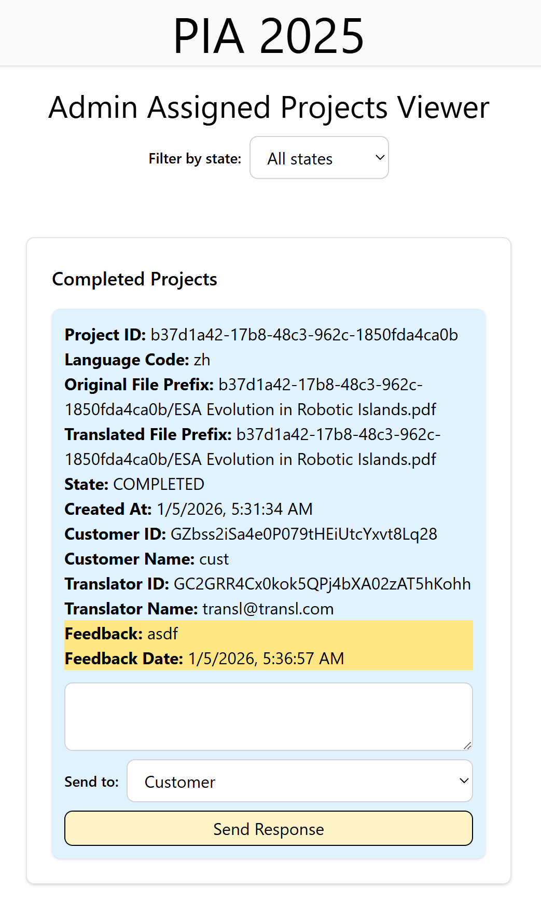

# Další ukázky

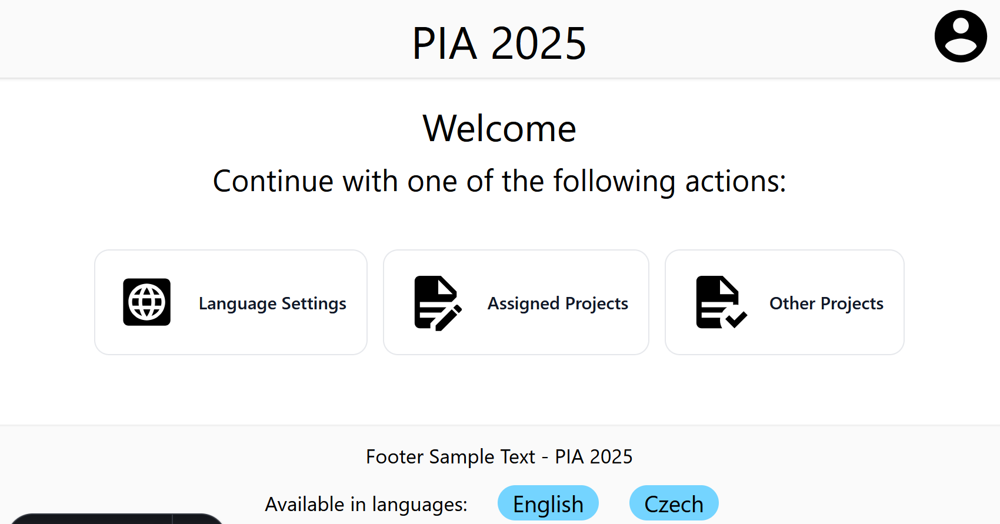

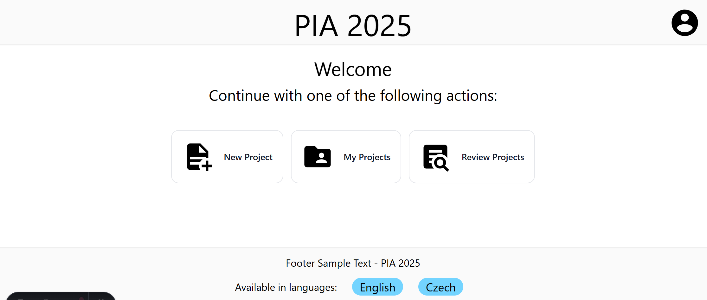

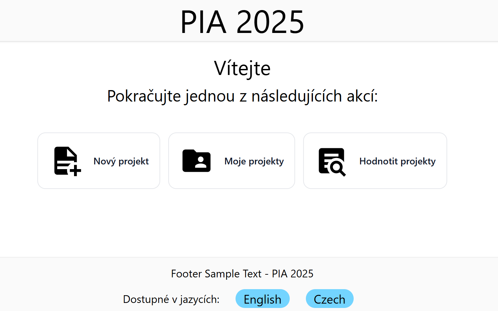

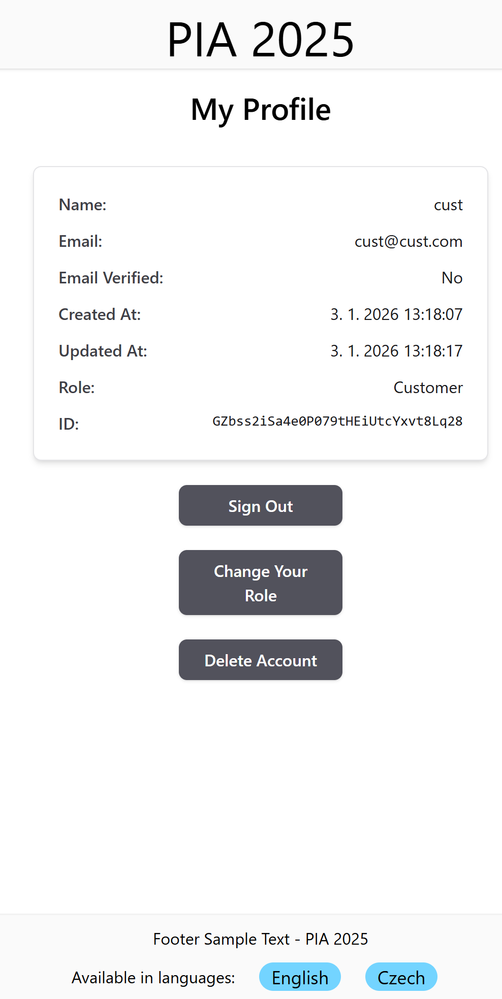

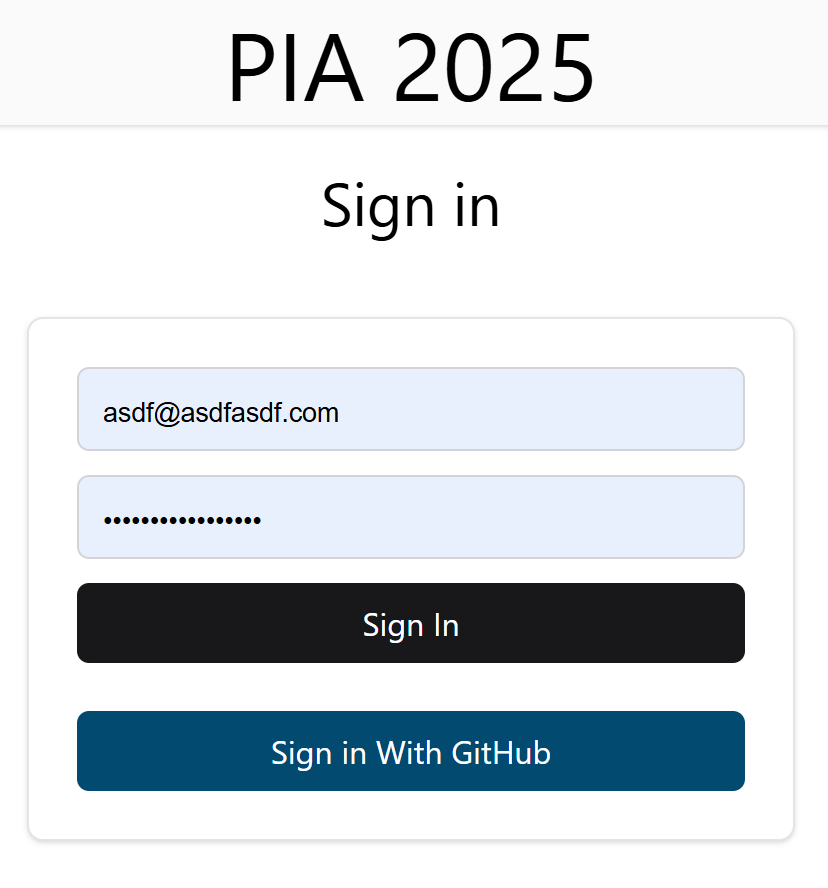

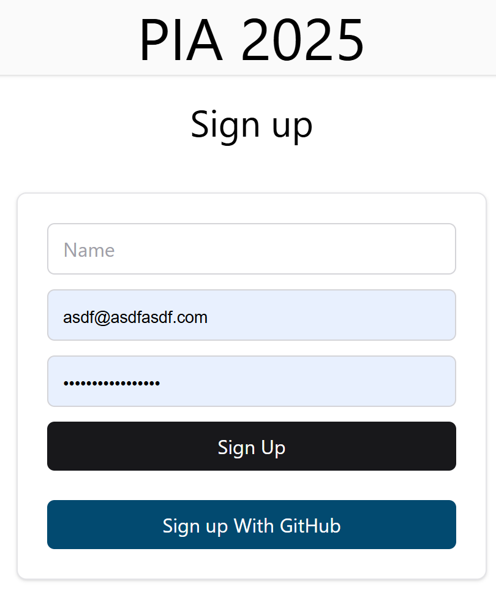

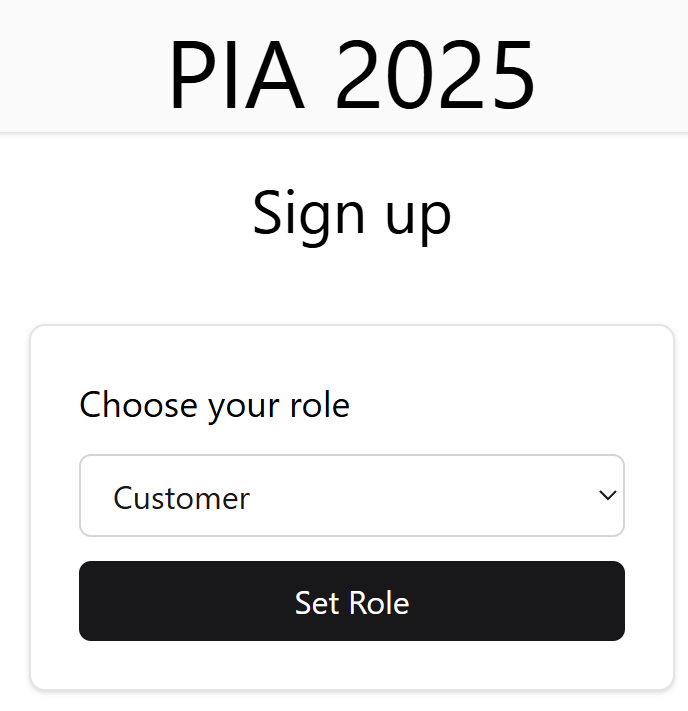

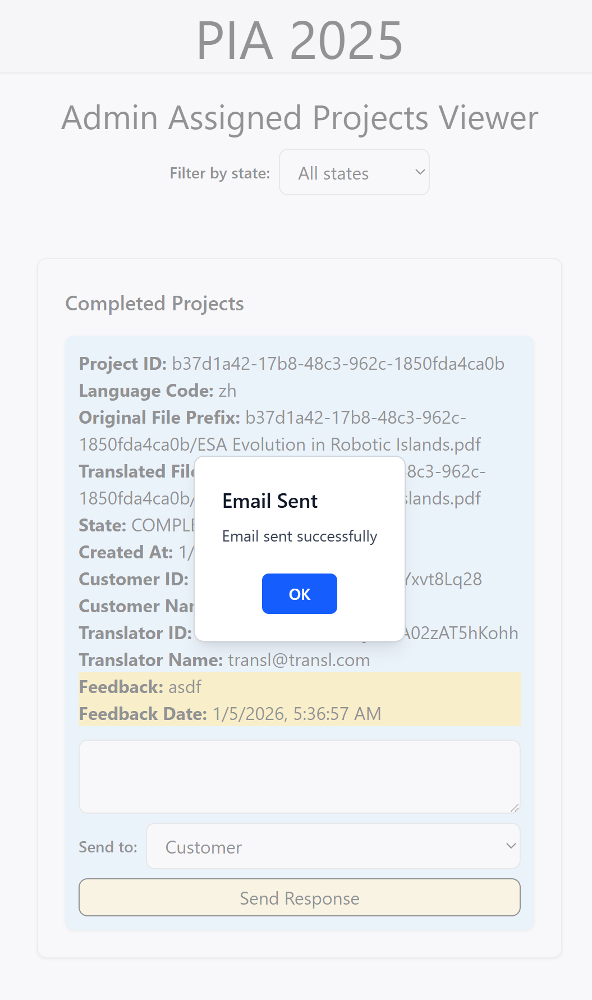

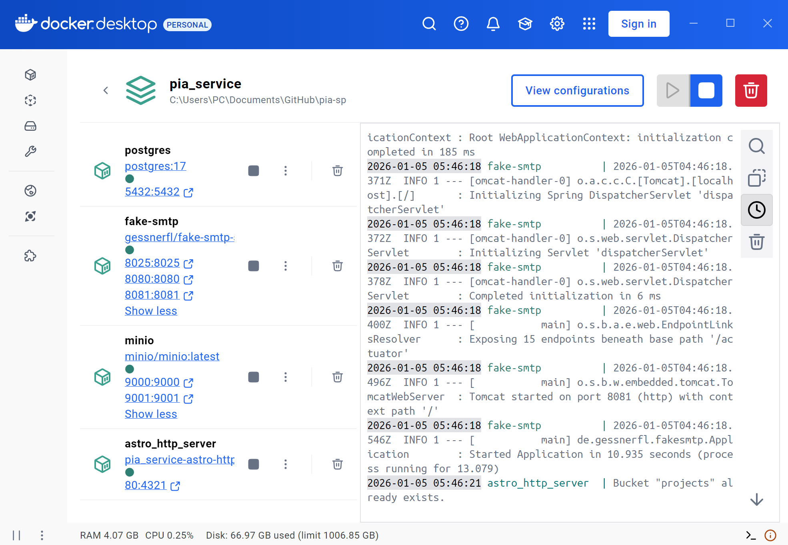

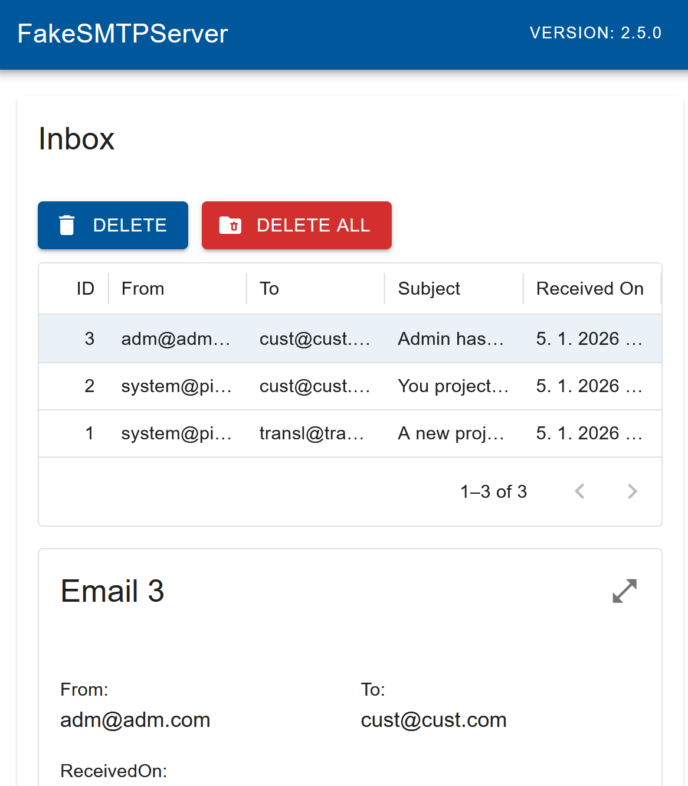
